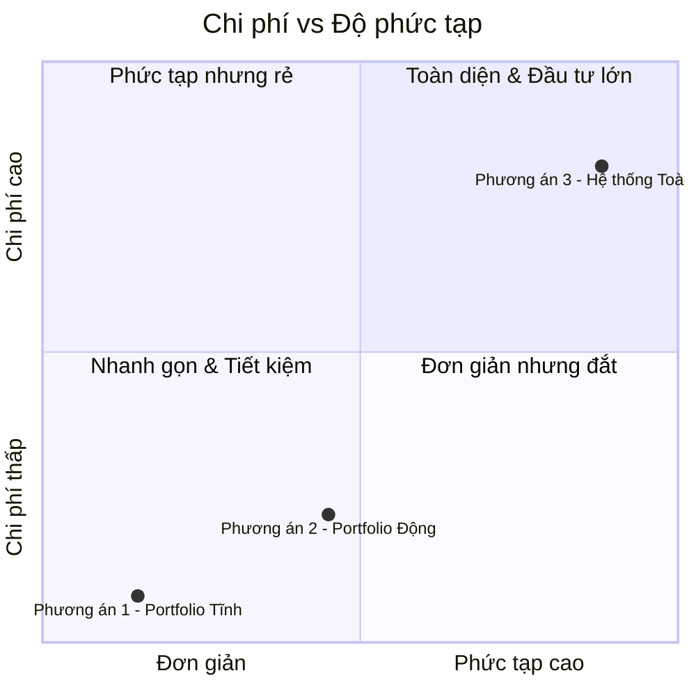
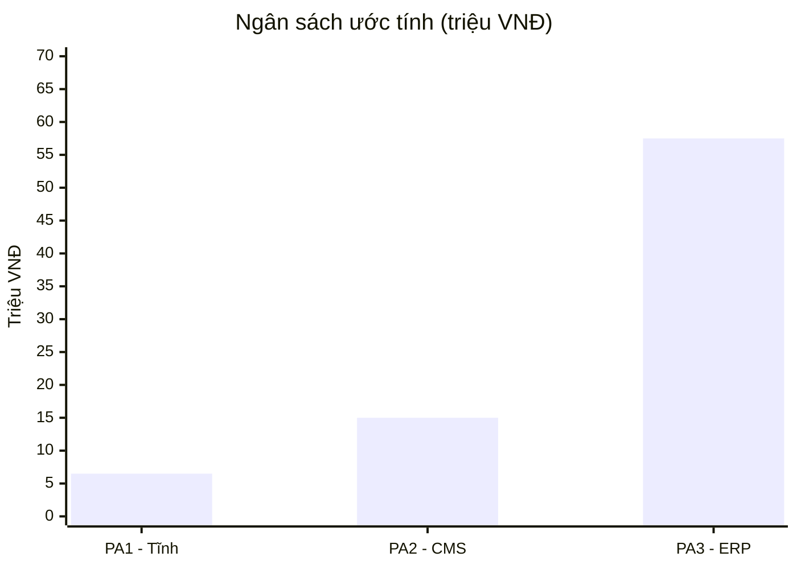
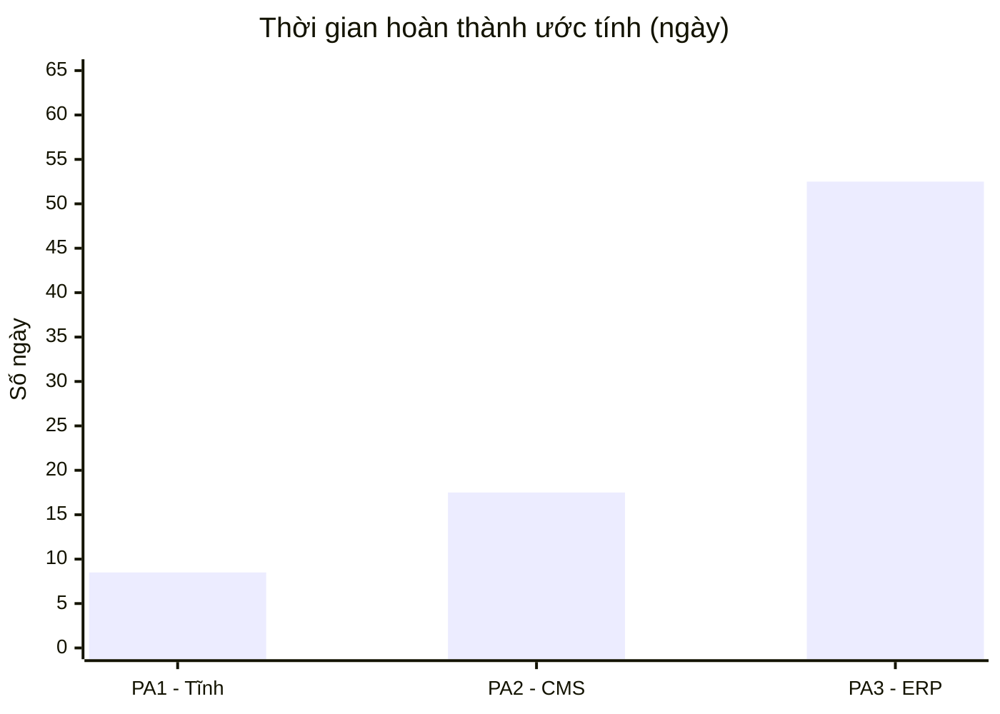
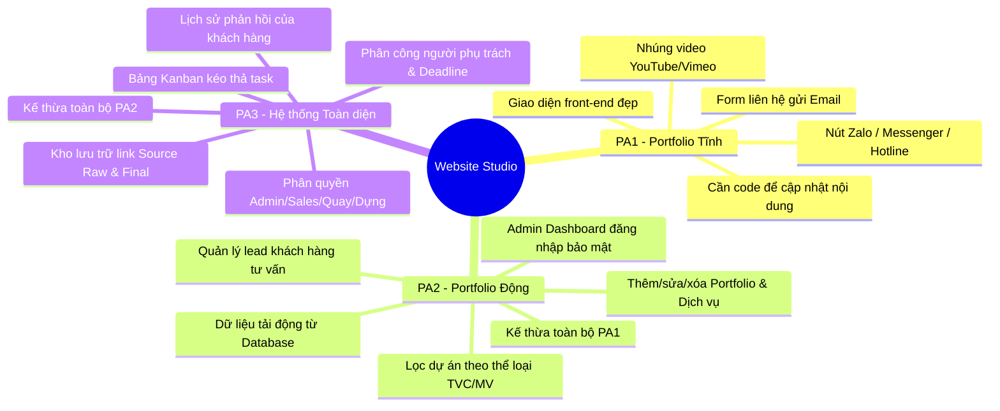
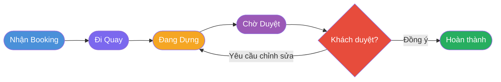
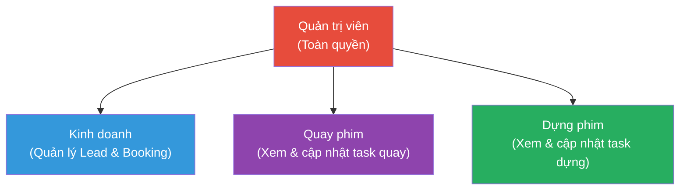

# SO SÁNH 3 PHƯƠNG ÁN — VISUALIZED

> Dựa trên tài liệu `De_xuat_Web_Studio_3_Options.md`

---

## 1. Vị trí các phương án: Chi phí vs Độ phức tạp

---

## 2. So sánh Ngân sách (triệu VNĐ — giá trị trung bình)

---

## 3. So sánh Thời gian hoàn thành (ngày — giá trị trung bình)

---

## 4. Bản đồ tính năng theo từng phương án

---

## 5. Workflow sản xuất (Option 3 — Kanban)

---

## 6. Sơ đồ phân quyền nhân sự (Option 3)

---

## 7. Bảng tóm tắt so sánh

| Tiêu chí | Option 1 | Option 2 | Option 3 |
| :--- | :---: | :---: | :---: |
| Thời gian hoàn thành | 7–10 ngày | 14–21 ngày | 45–60 ngày |
| Ngân sách | 5–8 triệu | 12–18 triệu | 45–70 triệu |
| Hosting / Server | Miễn phí | VPS ~2.5–4tr/năm | VPS ~2.5–4tr/năm |
| Tự cập nhật nội dung | ❌ | ✅ | ✅ |
| Quản lý Lead khách hàng | ❌ | ✅ | ✅ |
| Phân quyền nhân sự | ❌ | ❌ | ✅ |
| Kanban & Workflow | ❌ | ❌ | ✅ |
| Kho lưu trữ file dự án | ❌ | ❌ | ✅ |
<!-- | Phù hợp khi | Mới bắt đầu | Cần marketing | Vận hành chuyên nghiệp | -->
